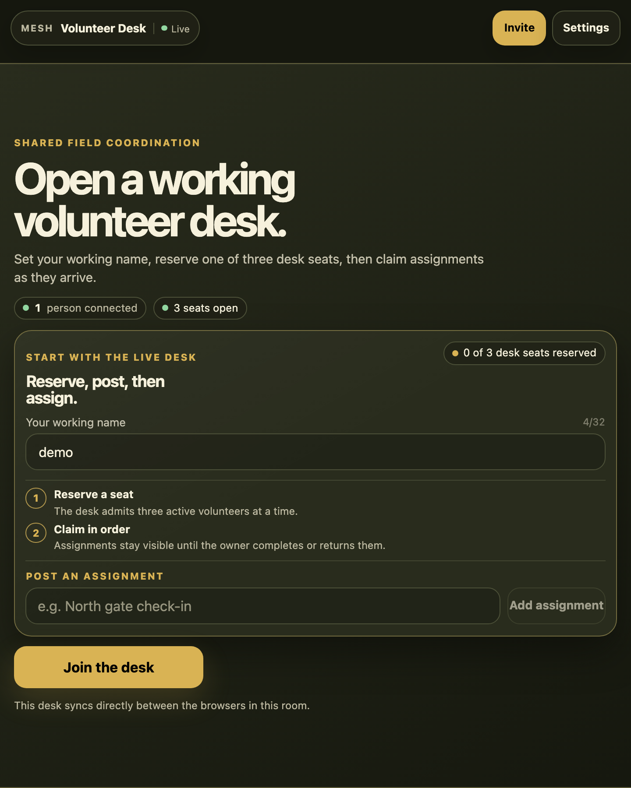
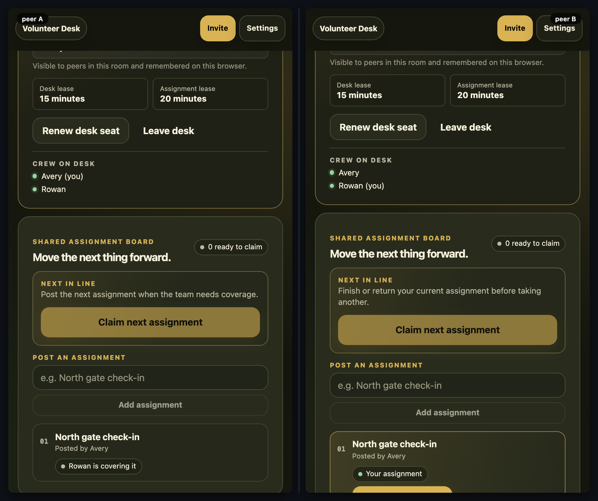

# Volunteer Desk

[](https://baditaflorin.github.io/mesh-volunteer-desk/)
[](https://github.com/baditaflorin/mesh-volunteer-desk/blob/main/package.json)
[](./LICENSE)

> A browser-local desk for small field crews to reserve coverage, post concrete needs, and move assignments forward together.

**Live:** https://baditaflorin.github.io/mesh-volunteer-desk/

**Source:** https://github.com/baditaflorin/mesh-volunteer-desk



## How the desk works

1. Enter a working name and reserve one of three active desk seats.
2. Post a specific assignment for the room, whether or not you hold a seat yet.
3. An admitted volunteer claims the oldest available assignment.
4. The owner completes it or returns it to the shared queue. Claims expire, so disconnected peers cannot strand work.

Everything synchronizes directly between browsers in the same room with Yjs and WebRTC. There is no app database, account, or central coordinator.

The desk uses a 15-minute seat lease and a 20-minute assignment lease. Use the **Renew desk seat** control during longer sessions.



## Quickstart

Open the live URL on each device, then use **Invite** in the app bar to share the room. The room ID is the boundary for shared data, so share it deliberately.

For local development, clone `mesh-common` beside this repository:

```bash
git clone https://github.com/baditaflorin/mesh-common
git clone https://github.com/baditaflorin/mesh-volunteer-desk
cd mesh-volunteer-desk
npm ci
npm run dev
```

`mesh-common` must be a sibling directory because the app uses `file:../mesh-common` during development.

## Validate and publish

```bash
npm run fmt:check
npm run typecheck
npm run test:unit
npm run test:e2e
npm run smoke
npm run audit:security
```

GitHub Pages serves the committed `docs/` directory from `main`. Refresh the visual artifacts after a meaningful UI change:

```bash
npm run screenshot
npm run demo
```

## Self-hosted infrastructure

| Service          | Endpoint                               | Purpose                     |
| ---------------- | -------------------------------------- | --------------------------- |
| Signaling        | `wss://turn.0docker.com/ws`            | WebRTC signaling fan-out    |
| TURN credentials | `https://turn.0docker.com/credentials` | Ephemeral relay credentials |
| TURN relay       | `turn:turn.0docker.com:3479`           | Relay fallback              |

The Settings drawer lets a user override signaling and TURN endpoints locally. If an endpoint is unavailable, the app continues with the browser's direct mesh path when possible.

## Privacy

Everything posted to a room is visible to the people in that room. A local working name, cryptographic identity, and browser settings remain on the device except where the app intentionally shares the name with the room to make coordination legible.

Read the full [privacy model](docs/privacy.md) before using the desk for sensitive work.

## License

MIT — see [LICENSE](LICENSE).
